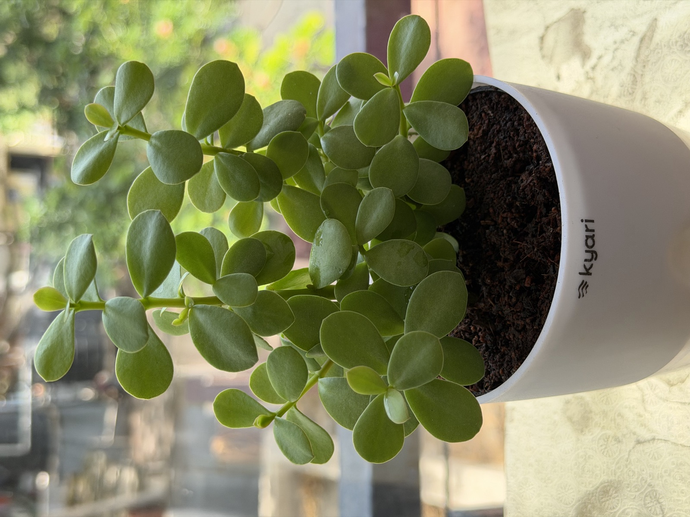

+++
date = '2026-06-23'
draft = false
title = 'Everything Wants to Stay Alive'
summary = 'Plant, Time, Healing and everything in between'
+++

I was gifted a jade plant by someone who was very special to me.

In fact, it wasn't the first jade plant they had gifted me. The previous one was the first plant I had ever received as a gift. I had absolutely no idea how to care for it.

I kept it in the office because I thought it was an indoor plant. It came with one of those trays underneath the pot. I thought the tray was meant to hold water so the plant could drink whenever it needed. So I kept it full.

All the time.

The soil was never allowed to dry. Before long, white mould started appearing on the surface.

Trying to fix the problem, I moved the plant near a window where it could get indirect sunlight. One Monday morning, I walked into the office and found it repotted—badly—and completely soaked.

I assume it must have fallen over sometime during the weekend and someone was trying to help.

The plant never recovered. Eventually, it died.

Months later, after we had moved into a new office, they gifted me another jade plant.

I still don't know why they gifted me another jade plant. Maybe they felt bad that I had managed to kill the first one.

This time, I was determined not to repeat myself.

I watered it sparingly. Yet one morning I walked in and found the soil wet again. Someone had watered it.

That same day, I took the plant home (furiously).

I placed it behind the balcony window where it would get indirect sunlight and made a simple request to everyone at home:

Please don't water the plant.

Then I did something that felt surprisingly difficult.

NOTHING.

I left it alone.

For nearly three weeks, I didn't water it at all. I removed the mould from the top layer of soil and waited for everything to dry out completely.

The plant had three main stems. One of them didn't make it.

I cut it away.

Beyond that, I stopped trying to fix the plant.

I simply gave it what it needed most: time.

I trusted the process.

I truly believed that the plant wanted to stay alive.

Around the same time, the person who had gifted me the plant and I had to part ways.

While I was trying to come to terms with that loss, I couldn't get myself to throw the plant away.

I couldn't let the plant die too. Not after everything else.

Somewhere in my mind, keeping it alive felt important.

Weeks passed.

Then one day I stepped onto the balcony and noticed something new.

Tiny buds.

Fresh growth.

I remember feeling disproportionately happy about it.

Over time, I learned its signals.

The leaves would become plump a day or two after watering and slowly thin out over the following week. Instead of following schedules, I started paying attention.

I watered it when it asked.

Nothing more.

Nothing less.

The plant continued to grow.

And somewhere along the way, so did I.

Today, I take pride in the plant, but not because I saved it.

The best thing I did was keeping it distant and letting the plant heal by itself.

I stopped trying to fix it. I stopped worrying about whether it would survive. I gave it some sunlight, watered it when it needed it, and let it figure the rest out.

Eventually it healed.

I still think of them sometimes when I see the plant. I probably always will.

Maybe some things heal the same way.

Not because we fix them.

Not because we save them.

Just because we give them enough time.